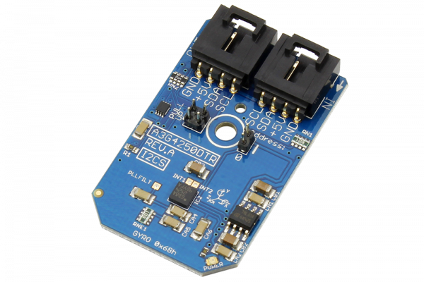

[](https://store.ncd.io/product/a3g4250dtr-3-axis-digital-output-gyroscope-i2c-mini-module/).

# A3G4250DTR

STMicroelectronic’s A3G4250D is a low-power 3-axis angular rate sensor which provides unprecedented stability at zero rate level and sensitivity over temperature and time. The sensing element is manufactured using a dedicated micro-machining process developed by ST Microelectronics to produce inertial sensors and actuators on silicon wafers. The A3G4250D has a full scale of ±245 dps and is capable of measuring rates with a user-selectable bandwidth.
This Device is available from www.ncd.io

[SKU: A3G4250DTR]

(https://store.ncd.io/product/a3g4250dtr-3-axis-digital-output-gyroscope-i2c-mini-module/)
This Sample code can be used with Raspberry Pi.

Hardware needed to interface A3G4250DTR 3Axis Gyroscope Sensor With Raspberry Pi :

1. <a href="https://store.ncd.io/product/a3g4250dtr-3-axis-digital-output-gyroscope-i2c-mini-module/">A3G4250DTR 3Axis Gyroscope Sensor</a>

2.  <a href="https://store.ncd.io/product/i2c-shield-for-raspberry-pi-3-pi2-with-outward-facing-i2c-port-terminates-over-hdmi-port/">Raspberry Pi I2C Shield</a>

3. <a href="https://store.ncd.io/product/i%C2%B2c-cable/">I2C Cable</a>

# Python

Download and install smbus library on Raspberry pi. Steps to install smbus are provided at:

https://pypi.python.org/pypi/smbus-cffi/0.5.1

Download (or git pull) the code in pi. Run the program.

```cpp
$> python A3G4250DTR.py
```
The lib is a sample library, you will need to calibrate the sensor according to your application requirement.
